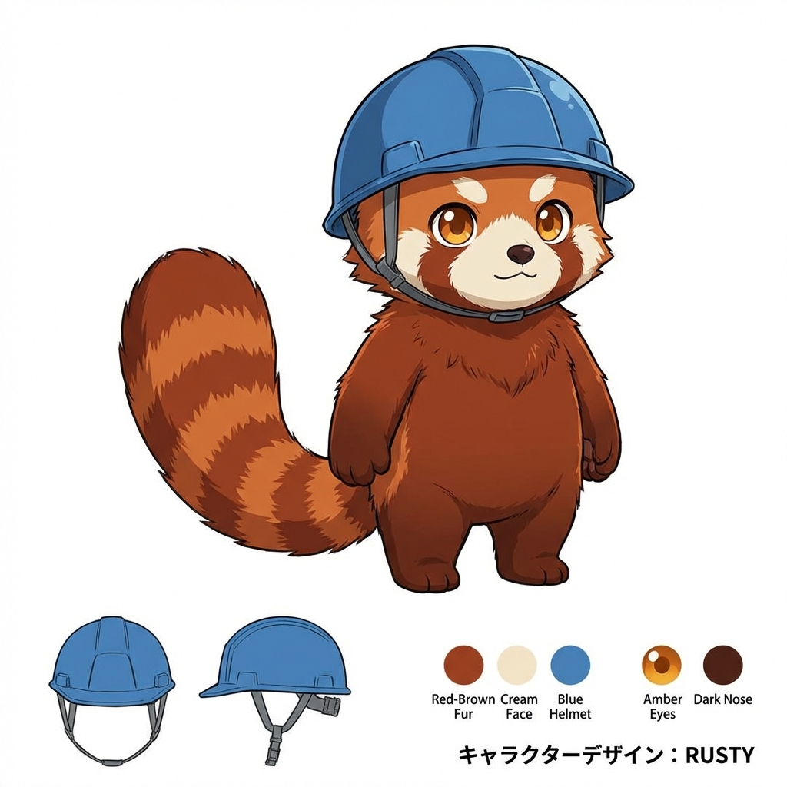
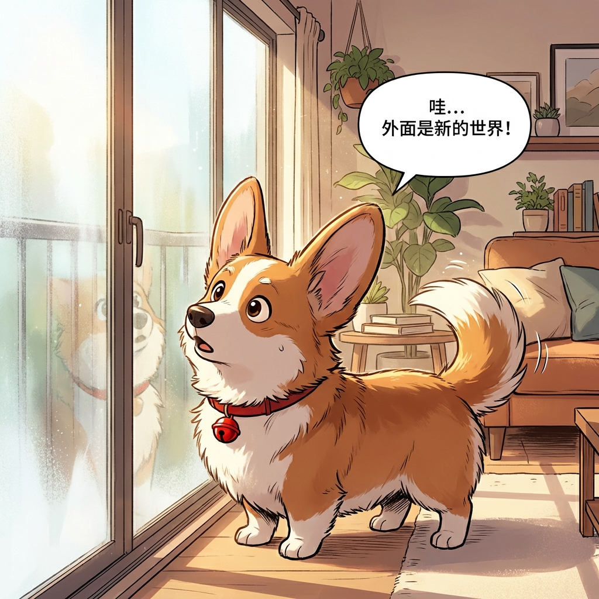
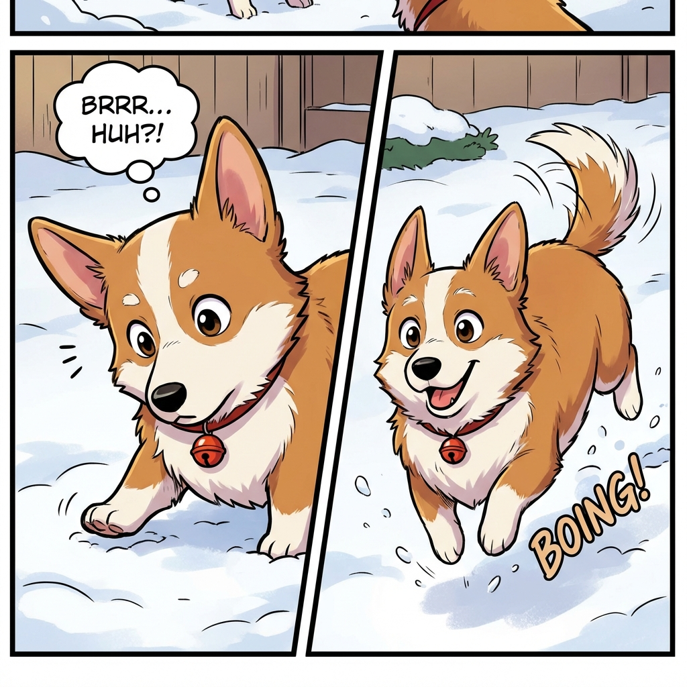

# 🎨 AI Comic Generator Pro 🚀

> **专业编剧 + 分镜师 + AI 智能体，一站式生成你的专属四格漫画**

这是一个基于 AI 的专业漫画生成工具，不仅支持一句话创意生成剧本，更引入了先进的 **Multi-Agent 智能体协作系统**。通过“导演”与“评论家”的迭代优化，确保每一部漫画在剧本质量、角色一致性和视觉冲击力上都达到专业水准。


---

## 🖥️ 系统截图 (System Screenshots)

### 首页与灵感库 (Home & Inspiration Library)


### 创意详情 (Inspiration Details)


### 脚本生成与编辑 (Script Generation & Editing)


## 🖼️ 成果展示 (Showcase)

### 角色一致性 (Character Consistency)
系统首先生成详细的角色设定图，确保整个故事中主角外观的高度统一。


### 生成的分镜 (Generated Panels)
基于 AI 优化后的剧本生成的高质量、上下文关联的分镜图。
| 分镜 1 | 分镜 2 |
| :---: | :---: |
|  |  |
| **分镜 3** | **分镜 4** |
|  |  |

---

## ✨ 核心特性

### 🤖 Multi-Agent 智能体系统 ⭐ NEW
- **导演智能体 (Director)**：负责创意构思、剧情编排和镜头规划。
- **评论家智能体 (Critic)**：从角色一致性、镜头语言、情感冲击等5个维度进行评审并给出改进建议。
- **迭代优化**：智能体之间自动协作，直到剧本评分达到目标（如 8.0+）才开始绘图。

### 🧠 思维链透明化 (Chain of Thought) ⭐ NEW
- 用户可以实时查看 AI 的“思考过程”：核心冲突分析、故事结构选择、角色动机设定、色彩基调规划。
- 让 AI 的决策不再是黑盒，赋予创作过程更多确定性。

### 📊 专业评估系统 ⭐ NEW
- **5大维度评分**：角色一致性、镜头语言、情感冲击、对话质量、视觉冲击。
- **可视化雷达图**：直观展示每次迭代的进步。

### 🎥 专业镜头语言系统
- **15种镜头组合**：5种景别（极远景至特写）× 3种角度（平视、俯视、仰视）。
- **智能推荐**：基于电影镜头理论（StudioBinder）自动推荐最佳构图。

### ✏️ 完整编辑工作流
- **脚本编辑**：自由修改场景描述和对话。
- **历史管理**：SQLite 驱动的本地数据库，支持自动保存、搜索、删除和重新编辑。

---

## 🏗️ 技术架构

### 技术栈
- **前端**: React 19, TypeScript, Tailwind CSS, Shadcn/UI, Lucide Icons
- **后端**: Node.js, Express, TypeScript
- **数据库**: SQLite (better-sqlite3)
- **AI 模型**: 
  - **Gemini 2.0 Flash**: 负责剧本创作、逻辑推理与智能体协作。
  - **Gemini 3 Pro Image Preview**: 负责高质量图像生成。

### 核心文档
详细技术说明请参考 [docs](./docs) 目录：
- [项目架构详解](./docs/architecture.md)
- [Multi-Agent 系统说明](./docs/agent-system.md)
- [数据库与图片设置指南](./docs/database-guide.md)
- [可视化系统指南](./docs/visualization-guide.md)
- [故障排除手册](./docs/troubleshooting.md)

---

## 🚀 快速开始

### 环境要求
- Node.js 18.0+
- pnpm (推荐)
- Gemini API Key

### 安装步骤

1. **克隆仓库**
```bash
git clone https://github.com/liuestc/ai-comic-generator.git
cd ai-comic-generator
```

2. **后端配置**
```bash
cd backend
cp .env.example .env # 填入你的 GEMINI_API_KEY
pnpm install
pnpm run init-db # 初始化数据库
pnpm dev
```

3. **前端配置**
```bash
cd ../frontend
pnpm install
pnpm dev
```

4. **访问应用**
打开浏览器访问：`http://localhost:5174` (或 Vite 分配的端口)

---

## 🎮 使用指南

1. **普通模式**：输入创意 -> 生成脚本 -> 编辑 -> 生成图像。
2. **AI 智能体模式**：输入创意 -> AI 自动迭代优化 -> 实时查看思考过程 -> 自动生成最终漫画。
3. **查看历史**：在“历史记录”标签页浏览和管理过往作品。

---

## 🤝 贡献与反馈

欢迎提交 Pull Request 或 Issue！

**Made with ❤️ by liuestc + Manus AI**
